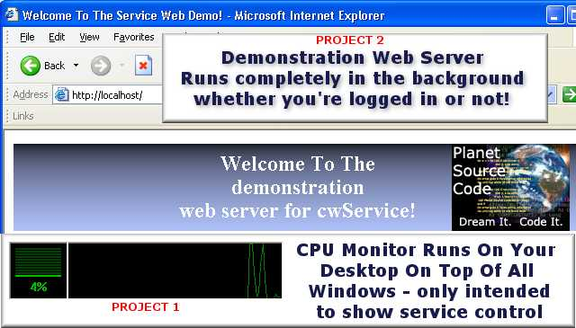



## Windows NT\-2K\-XP\-Vista Service Control : Create your own web server, proxy, firewall and more\!

### Description

Turn your VB5/6 Application into a WINDOWS SERVICE that can run in the background without you even logging into your computer - just like Anti-Virus applications do!  

Enclosed are two demonstrations of what you can do... one being a CPU monitor (mainly to show you how to interact with services using the MS Windows Service Manager) and the second being a very simple web server - BOTH projects are from PSC and were mildly updated to become services! (See the enclosed README for author credits and links.)  

Included with this project is the source and compiled control (Again, see the README for instructions.) The source for the VB projects should be rather straight-forward (the sections where we've added service control are commented - the 3rd party apps; please see their postings here at PSC.)  

Q: Why do I need a custom control to create services within VB? 

A: Visual Basic (prior to .NET) has no ability for VB to communicate properly with the Windows Service Manager on a stable framework. Worse yet, for those of you accustomed to using NtSVC from Microsoft years ago you've found that it crashes when you try to use sub-classing in your application.  

Control Source: Basic image files and such have been removed to ensure the smallest possible download. Should you wish to re-create the sources, see the resource file for the file names of the images needed and create your own!
 
### More Info
 
Read the enclosed README.TXT file for complete details.

             |
---                |---
**Submitted On**   |2007-03-11 20:40:12
**By**             |[CentralWare Development Centers](https://github.com/Planet-Source-Code/PSCIndex/blob/master/ByAuthor/centralware-development-centers.md)
**Level**          |Intermediate
**User Rating**    |5.0 (15 globes from 3 users)
**Compatibility**  |VB 5\.0, VB 6\.0
**Category**       |[Custom Controls/ Forms/  Menus](https://github.com/Planet-Source-Code/PSCIndex/blob/master/ByCategory/custom-controls-forms-menus__1-4.md)
**World**          |[Visual Basic](https://github.com/Planet-Source-Code/PSCIndex/blob/master/ByWorld/visual-basic.md)
**Archive File**   |[Windows\_NT2053143112007\.zip](https://github.com/Planet-Source-Code/centralware-development-centers-windows-nt-2k-xp-vista-service-control-create-your-own-web__1-68114/archive/master.zip)

### API Declarations

TONS! See sources for the list.

